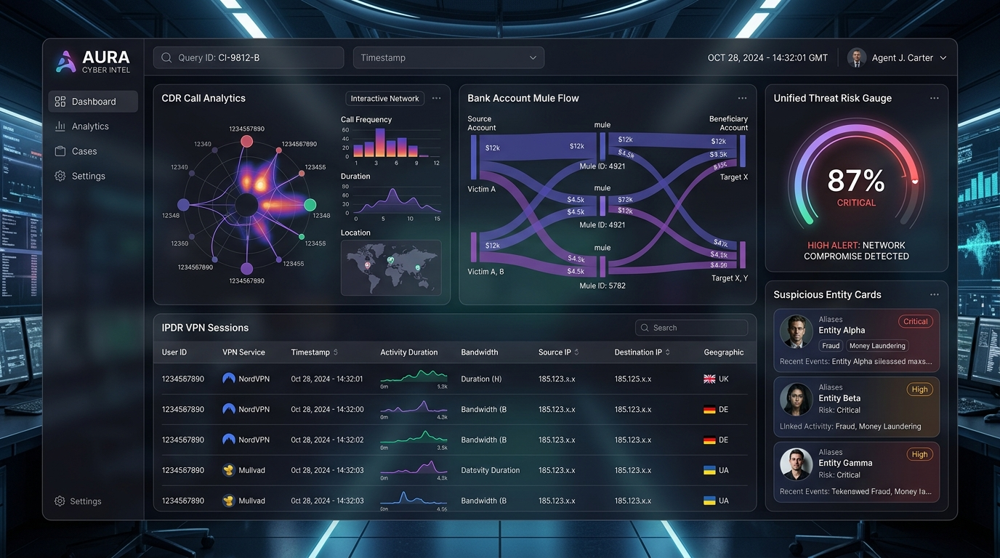
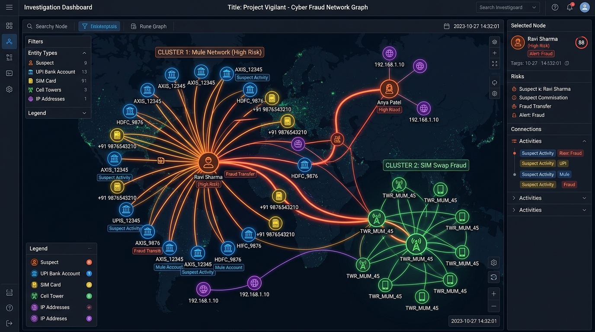
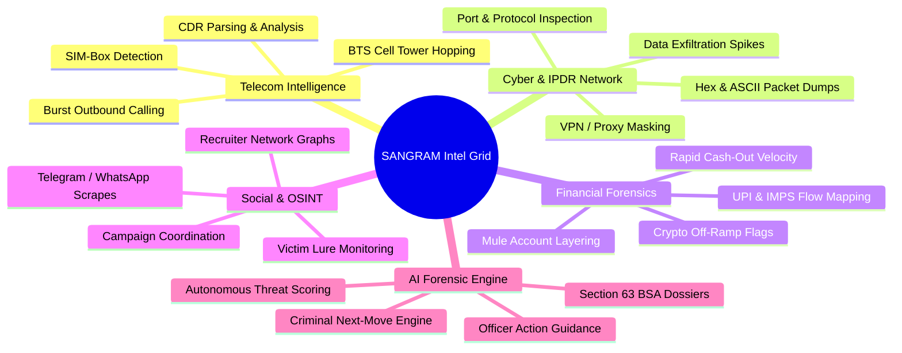
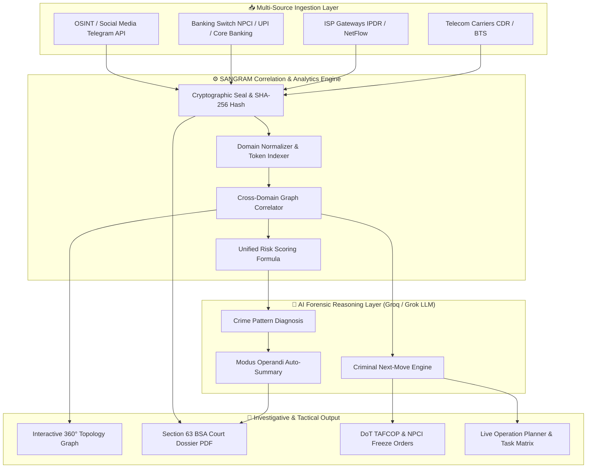
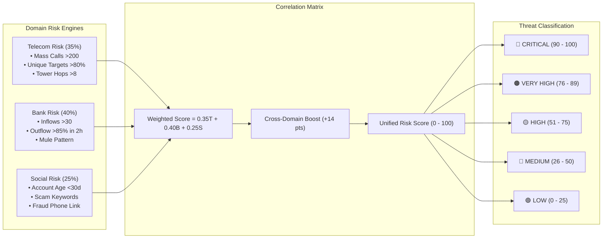

# 🛡️ SANGRAM — Unified Investigative Analytics Platform
### *National Digital Intelligence & Cross-Correlation Matrix for Law Enforcement Agencies*

<div align="center">


[](https://github.com/rautsiddharth82-crypto/Sangram)
[](https://github.com/rautsiddharth82-crypto/Sangram)
[](https://github.com/rautsiddharth82-crypto/Sangram)
[](https://github.com/rautsiddharth82-crypto/Sangram)
[](https://github.com/rautsiddharth82-crypto/Sangram)

</div>

---

## 📌 Executive Overview

**SANGRAM** (System for Automated Network Gathering, Risk Analysis & Monitoring) is an enterprise-grade cybercrime intelligence and digital forensics matrix designed for cyber cells, intelligence bureaus, and police departments.

Modern cybercrime syndicates operate across fragmented domains: SIM boxes for bulk outreach, VPNs for masked network communications, multi-tier mule bank networks for swift money laundering, and Telegram channels for decentralized command & control. SANGRAM connects these disparate silos in real time, delivering **instant multi-domain cross-correlation, AI-powered criminal next-move prediction, and court-admissible Section 63 BSA evidence dossiers**.

---

## 📊 Visual Showcase & Interactive Console

### 1. Unified Cyber Intelligence Dashboard
Real-time telemetry, threat risk meters, suspicious entity tracking, and cross-domain correlation metrics.



### 2. Interactive Cross-Domain Topology Graph
Live link analysis graph mapping suspects, phone numbers, IMEI SIM-boxes, mule bank accounts, cell towers, and VPN exit nodes.



---

## ⚡ Key Capabilities & Intelligence Domains



### 1. 📞 Call Detail Records (CDR) Analysis
- **SIM-Box & Mass-Dialer Signatures:** Automatically isolates asymmetric calling ratios (>85% outbound), high unique-target distributions, and short call durations (<45s) typical of OTP interception robocalls.
- **Tower Hopping Detection:** Tracks Base Transceiver Station (BTS) hops across cell towers (e.g., Nariman Point $\rightarrow$ BKC $\rightarrow$ Andheri) within short timeframes.

### 2. 🌐 IP Detail Records (IPDR) & Packet Telemetry
- **VPN Masking & Geolocation Anomaly:** Maps dynamic IP sessions to Autonomous System Numbers (ASNs) and detects exit nodes (NordVPN SG, ExpressVPN MY).
- **Data Exfiltration Spikes:** Flags sudden high-volume uploads coinciding with active fraud outreach.
- **Raw Hex & ASCII Packet Inspector:** Real-time hex dump dissection for protocol verification and cryptographic payload inspection.

### 3. 🏦 Financial Trails & Mule Network Detection
- **UPI / IMPS Transaction Correlator:** Maps deposits directly against outbound call events (e.g., victim transaction completed 15s after phone call termination).
- **Layering Velocity Engine:** Identifies 3-tier mule account hops (A204 $\rightarrow$ A301 $\rightarrow$ A502) and rapid cash-out velocity (90%+ outflow within 120 minutes of credit).

### 4. 🕵️ Social Media & OSINT Telemetry
- **Fraud Campaign Discovery:** Monitors coordinated recruitment channels, scam bot accounts, and fraudulent job lure groups across Telegram and social platforms.

### 5. ⚖️ Section 63 BSA (Bharatiya Sakshya Adhiniyam) Legal Compliance
- **SHA-256 Cryptographic Chain of Custody:** Calculates NIST FIPS PUB 180-4 compliant hashes on all evidence logs upon LEIS gateway extraction.
- **Automated Court Dossier Generator:** Produces Part A (Investigating Officer Declaration) and Part B (Cyber Forensic Technical Expert) digital certificates admissible in Cyber Special Courts.

---

## 🔄 End-to-End System Workflow



---

## 🧮 Unified Risk Scoring Methodology

SANGRAM calculates a weighted composite risk score ($0 - 100$) across telecom, banking, and social vectors, applying a cross-domain correlation boost when multiple fraud vectors overlap in time:



$$\text{Unified Score} = \min\Big(100, \; \text{round}\big(0.35 \times T + 0.40 \times B + 0.25 \times S + \text{CrossDomainBoost}\big)\Big)$$

---

## 🛠️ Tech Stack & Architecture

| Component | Technology | Purpose |
|---|---|---|
| **Frontend Framework** | React 19, TypeScript, Vite 6 | High-performance reactive UI |
| **Styling & Design** | TailwindCSS v4, Glassmorphism UI | Sleek dark-mode law enforcement UI |
| **Icons & Motion** | Lucide React, Google Material Symbols, Motion | Micro-animations and responsive components |
| **Network Visualization** | HTML5 Canvas / Custom D3-Force Engine | Interactive node-link topology rendering |
| **Backend Runtime** | Node.js, Express.js, TypeScript, TSX | RESTful APIs, data streaming, file parsing |
| **Forensics & Hashing** | Node Crypto (SHA-256), Multer | LEIS extraction and chain of custody hashing |
| **AI Forensic Reasoning** | Groq Cloud API (`llama-3.3-70b-versatile` / `groq/compound`) / Grok AI | High-speed LLM inference for next-move prediction |

---

## 📂 Project Repository Structure

```
SANGRAM/
├── assets/                          # Documentation screenshots & architecture visuals
│   ├── banner.png                   # High-resolution platform banner
│   ├── dashboard.png                # Dashboard interface preview
│   └── topology.png                 # Network graph preview
│
├── Backend/                         # Express.js REST API Server
│   ├── api/
│   │   └── index.ts                 # Core API router, risk calculations, AI client
│   ├── public/                      # Static status page for serverless hosts
│   ├── .env.example                 # Backend environment variable template
│   ├── package.json                 # Backend dependencies & build scripts
│   ├── tsconfig.json                # TypeScript configuration
│   └── vercel.json                  # Vercel serverless deployment config
│
├── Frontend/                        # React 19 Frontend Web Console
│   ├── src/
│   │   ├── components/
│   │   │   ├── modals/              # Copilot, Export, AddNote, Network modals
│   │   │   ├── screens/             # CDR, IPDR, Bank, Social, LogInspection screens
│   │   │   ├── InteractiveNetworkGraph.tsx # Canvas link analysis graph
│   │   │   ├── SideNavBar.tsx       # Primary navigation bar
│   │   │   └── TopAppBar.tsx        # Top status and telemetry bar
│   │   ├── data/
│   │   │   └── mockData.ts          # Forensic records, case metadata, anomalies
│   │   ├── services/
│   │   │   └── api.ts               # Frontend API client
│   │   ├── App.tsx                  # Main route and modal orchestrator
│   │   ├── index.css                # Global Tailwind CSS and neon accents
│   │   └── types.ts                 # Forensic intelligence TypeScript interfaces
│   ├── index.html                   # HTML entry point
│   ├── package.json                 # Frontend dependencies & Vite scripts
│   └── vite.config.ts               # Vite configuration
│
└── README.md                        # Master Documentation
```

---

## 🚀 Quickstart & Local Setup

### Prerequisites
- **Node.js**: `v18.0.0` or higher
- **npm**: `v9.0.0` or higher
- **Groq / Grok API Key** *(Optional — rich built-in fallback data is provided automatically)*

### 1. Clone the Repository
```bash
git clone https://github.com/rautsiddharth82-crypto/Sangram.git
cd Sangram
```

### 2. Backend Setup
```bash
cd Backend
npm install
cp .env.example .env
```
*Configure `.env` with your preferred settings:*
```env
GROQ_API_KEY="gsk_your_groq_api_key_here"
GROQ_MODEL="llama-3.3-70b-versatile"
PORT=5000
CORS_ORIGIN="http://localhost:3000"
```
*Start the Backend API Server:*
```bash
npm run dev
# Server running at http://localhost:5000
```

### 3. Frontend Setup
```bash
cd ../Frontend
npm install
```
*Start the Frontend Development Console:*
```bash
npm run dev
# App running at http://localhost:3000
```

---

## 📡 API Reference Overview

| Endpoint | Method | Description |
|---|---|---|
| `/api/health` | `GET` | System operational status, active AI provider & module health |
| `/api/cases` | `GET`, `POST` | List cases, filter by severity, register new investigation |
| `/api/cases/:id` | `GET` | Fetch complete 360° case dossier, suspects, and timeline |
| `/api/cdr` | `GET` | Retrieve Call Detail Records and isolated burst patterns |
| `/api/cdr/analyze` | `POST` | Evaluate telecom threat score from call volume and tower hops |
| `/api/ipdr` | `GET` | Retrieve IP sessions, VPN anomalies, and exfiltration events |
| `/api/bank` | `GET` | Fetch bank transactions and mule layering velocity alerts |
| `/api/social` | `GET` | OSINT intelligence, recruitment channels, and suspect handles |
| `/api/risk/score` | `POST` | Calculate unified composite risk score with cross-domain boost |
| `/api/network` | `GET` | Node-link topology graph data for cross-domain visualization |
| `/api/search` | `GET` | Universal entity search across suspects, accounts, and phones |
| `/api/evidence/upload` | `POST` | Secure evidence ingestion with automated SHA-256 hashing |
| `/api/ai/next-move` | `POST` | Criminal next-move prediction engine via Groq / Grok AI |
| `/api/ai/generate-dossier` | `POST` | Generate court-ready Section 63 BSA compliance dossier |

---

## 🔒 Security & Forensic Integrity

- **NIST FIPS PUB 180-4 Standard:** Cryptographic SHA-256 verification on all uploaded files.
- **Section 63 BSA Standard:** Automated electronic evidence certification declarations.
- **Audit Logging:** Every log access, case query, and AI recommendation is written to an immutable audit trail with officer badge numbers and IP stamps.

---

## ⚖️ License & Disclaimer

This project is built for cybercrime law enforcement analytics, research, and intelligence demonstrations. All case data in the demo repository is synthetically generated for testing and forensic validation purposes.

Licensed under the [MIT License](LICENSE).
